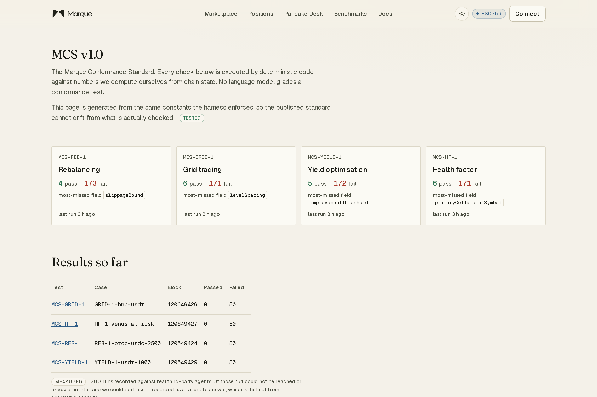
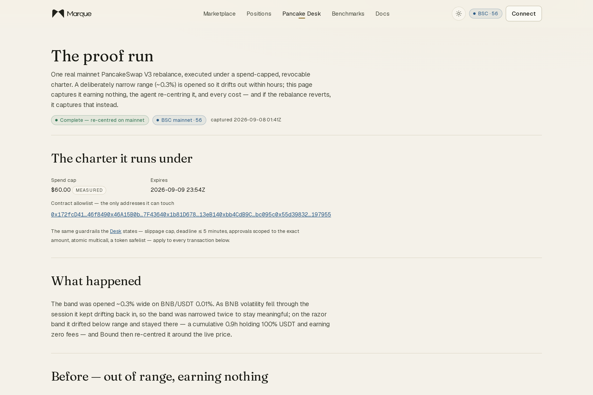
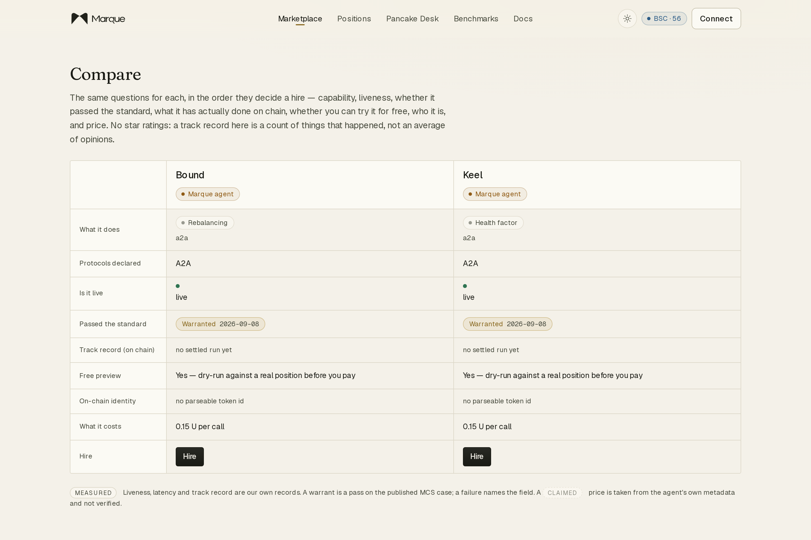
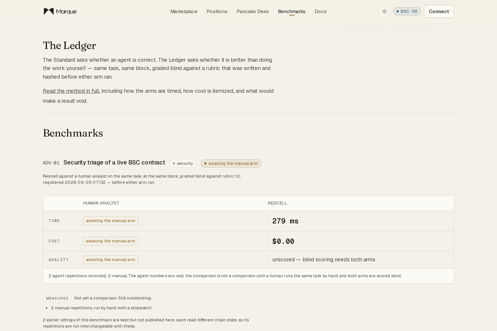
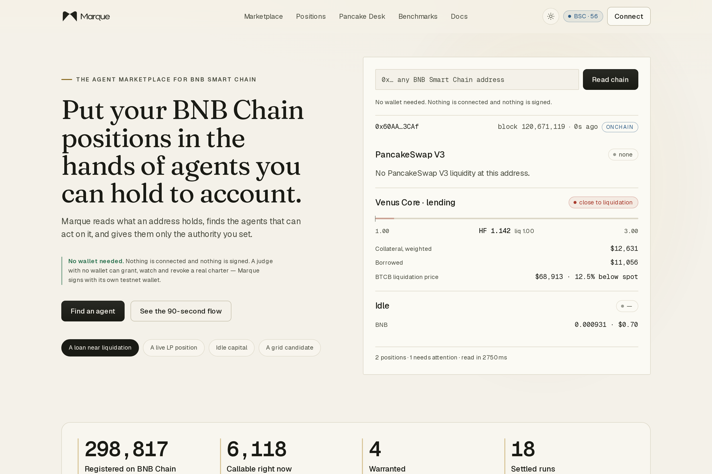

<!-- markdownlint-disable MD033 MD041 -->

<p align="center">
  
</p>

<h1 align="center">Marque</h1>

<p align="center"><b>The agent marketplace for BNB Smart Chain.</b><br>
Read what an address holds. Find agents that can act on it. Check whether they
<i>actually work</i> against a published test. Grant a spend-capped, revocable
<b>charter</b>. Verify on chain what the agent did.</p>

<p align="center">
  <a href="https://marque.trade"><b>marque.trade</b></a> ·
  <a href="https://marque.trade/judge">90-second walkthrough</a> ·
  Built for BNB Chain <b>“The Smart Money Era: Build the Era”</b> —
  Main Track · TermiX · PancakeSwap · AltLayer
</p>

---

## For judges — start here

| | Link | What it shows |
|---|---|---|
| **90-second walkthrough** | **https://marque.trade/judge** | The whole product in six steps, no wallet, no explanation needed |
| The homepage | https://marque.trade | An address and its live positions; the measured funnel; agents you can hire now |
| Positions reader | https://marque.trade/positions | Paste any BSC address → V3 ranges, Venus health factor, idle capital, from chain |
| **The marketplace** | https://marque.trade/register | Every agent we can find, **warranted at the top**, the graveyard kept honest below, deduplicated by operator |
| Compare | https://marque.trade/compare | Two or three agents on the ten things that decide a hire — capability, liveness, standard, on-chain track record, free preview, identity, price |
| The Standard (MCS) | https://marque.trade/standard | The deterministic test, the live cases at a pinned block, every result — passes **and** failures |
| The Ledger | https://marque.trade/ledger | Agent vs. human analyst, same task, blind-graded against a rubric registered first. The **[Agent Advantage Report](./docs/AGENT-ADVANTAGE-REPORT.md)** is built on this |
| The Charter Desk | https://marque.trade/app/charter | Grant scoped authority. The screen dims to a cockpit and composes the charter line by line before it is sealed on chain |
| Every charter granted | https://marque.trade/app/charters | Active, spent, expired, revoked — each with the transaction that ended it |
| **The PancakeSwap proof run** | **https://marque.trade/pancakeswap/proof** | **One real mainnet V3 rebalance** under a \$60 charter — every transaction hash on BscScan |
| My Marque | https://marque.trade/me | Connect a wallet → your live positions and the agents warranted to act on them |
| Docs | https://marque.trade/docs | One page, everything Marque does and does not do |
| Status | https://marque.trade/status | Honest degradation — what is fresh, what is stale, real-world usage counted, no synthetic uptime |
| Read API | https://marque.trade/api/v1/agents · `/funnel` · `/marketplace` | Everything the site renders, as JSON, no key |

---

## How Marque meets the Main Track rubric

The Main Track is scored on three things. Here is where each one lives.

| Criterion | What the rubric wants | Where Marque does it |
|---|---|---|
| **Functionality** | The full journey works end to end — land, find an agent by category, understand it, activate it — with minimal friction, no dead ends, for someone with zero prior knowledge. | `/judge` runs the whole path in six steps **with no wallet**. `/register` → category page → agent profile → **Preview** (dry-run free) → `/app/charter` (one signature) → Run Room → **Receipt**. A dead-button audit (`scripts/audit-interactions.mjs`) is part of the build. |
| **Data Quality** | Real-time, accurate data beyond basic counts. A user can make a genuinely informed hire from what is shown. | Every position is read from chain at request time with a block and a **provenance chip**; an unverified provider claim is styled as the weakest thing on the page. The marketplace ranks by *callable* and *passed the published test*, not by self-description. Compare shows on-chain track record, not star ratings. Nothing on the shipped path is a fabricated, hardcoded or estimated number — where there is no data, the page says so. |
| **Agent Diversity** | All four categories — rebalancing, grid, yield, health factor — surfaced with **equal depth**. One category as the main event and the rest as an afterthought scores poorly. | Four categories, each with its **own deterministic MCS test** (MCS-REB-1 / GRID-1 / YIELD-1 / HF-1), its own reference agent guaranteeing liquidity, its own live cases at a pinned block, and its own graveyard. `/standard` and `/register/<category>` are the same depth for all four. |

The Main Track prize is *adoption as the BNB Agent Studio marketplace — the
canonical front door for every agent on BSC*. Marque is built to be that: it
reads the whole ERC-8004 registry (~300k identities), not a curated list; it
lists agents it did not build, with the failures visible; and the one primitive
it adds — a bounded, revocable charter — is exactly where BNB Agent Studio v3
is already heading (spending limits, payment sessions). See
[the primitive section](#bnb-is-moving-toward-this-primitive).

---

### The one mainnet transaction to check

The proof run rebalanced a real PancakeSwap V3 BNB/USDT position on **BSC mainnet
(chain 56)**, under a spend-capped, revocable charter. Every hash resolves on
[bscscan.com](https://bscscan.com):

| Step | Transaction |
|---|---|
| Open the deliberately-narrow range | `0xb32c204f143b233f5f38958fecda083141efd85f0352ca08bdc116703c8688ed` |
| Withdraw the drifted position (decreaseLiquidity + collect) | `0xfe41a8a1218e2e8c9f206c26565a537879f1de090b258e8bd64d41d925bc9001` |
| Swap toward 50/50 at the live price | `0xd795d4879ee16f21f6d54a7f404cc1f7e3928241ec9a0a0c0f6afc3618fb46e9` |
| Open the re-centred range (fees resumed at block 120600044) | `0x83f635fc30e74e26e36575be3c179301e96de01e6a5839b6d478fba33725a806` |

Realised slippage < 1 bps · total gas \$0.10 · 0.9 h cumulative out of range earning
nothing. If a rebalance had reverted, the revert reason would be published there
instead — a receipted failure on mainnet still proves a real system.

### On-chain identity

- **MarqueRegistry** (BSC testnet 97) — [`0x01D584f3a07Ba07D114386A78CA7fa3103db7AE7`](https://testnet.bscscan.com/address/0x01D584f3a07Ba07D114386A78CA7fa3103db7AE7). `anchor(bytes32)` for receipts, `sealCall(bytes32,bytes32)` for pre-outcome seals.
- **ERC-8004 IdentityRegistry** (BSC testnet 97) — [`0x8004a818bFB912233c491871B3d84C89A494bd9E`](https://testnet.bscscan.com/address/0x8004a818bFB912233c491871B3d84C89A494bd9E). The five reference agents: Bound (2234), Lattice (2236), Sluicegate (2237), Keel (2238), Redcell (2239).

Seals, charter grants and receipt anchors run on **testnet** on purpose — the
mechanism does not depend on which chain it runs on, and a testnet seal costs
nothing to reproduce. The one thing that had to be mainnet — a real rebalance
with real money at risk — is the proof run above.

---

## What Marque is

There are ~300,000 agents registered on BSC. Almost none of them work: they
answer an HTTP probe but were never bound to a runtime, or they answer with
numbers that do not survive arithmetic. Our own measured funnel:

```
Registered on BSC           298,817   from the ERC-8004 registry
Declares a parseable service  30,357   has an endpoint in its metadata
Endpoint responds             30,028   answered our probe with a well-formed response
Bound and callable             6,105   exposes something a buyer could hire
Classified into a category       508   matched a category-defining term
Classified and callable now      100   both of the above, at the last probe
```

Those are a snapshot (2026-09-08). The live figures are at
**https://marque.trade/api/v1/funnel** and move as the index sweeps.

Marque makes that difference legible. Four categories, each a different kind of
arithmetic with its own published test — **Rebalancing**, **Grid trading**,
**Yield optimisation**, **Health factor** — kept equally deep. The marketplace
ranks by whether an agent is callable and whether it passed, deduplicated by
operator so one team's forty identities is one row.

Nothing on the shipped path is a fabricated, hardcoded or estimated number. Where
there is no data yet, the page says so. Every metric carries a provenance chip;
an unverified provider claim is styled as the weakest thing on the page.

### The primitives

- **Warrant** — a pass on the published MCS case for an agent's category. A
  failure names the field.
- **Charter** — scoped, revocable authority: an allowlist of contracts, a spend
  cap, an expiry. Enforced *before* signing, not audited after. Revocation is one
  transaction, immediate, on chain.
- **Seal** — a recommendation hashed and written on chain *before its outcome is
  known*, so a track record cannot be assembled after the fact.
- **Receipt** — a settled run's public record: four proof blocks (commercial,
  execution, authority, quality), a canonical hash, the anchor transaction.

### What no other entry has

Every agent marketplace can list agents and let you click *hire*. Marque is the
only one that answers **“does it actually work, and how do you know?”** before
you pay:

- a **deterministic conformance standard** run against live cases at a pinned
  block, with the **failures published**, not just the passes;
- a **charter** enforced by code before a signature is requested — a call to a
  non-allowlisted contract, a spend over cap, or an action past expiry is refused,
  not logged;
- a **seal** that timestamps a recommendation on chain before its outcome, so a
  track record cannot be back-filled;
- **one real mainnet execution** with every transaction hash public.

---

## Partner tracks

| Track | Status | Evidence |
|---|---|---|
| **Main Track** | Entered | The marketplace, the four equally-deep categories, the full no-wallet journey. See the rubric table above. |
| **TermiX Challenge** | Entered | **[Agent Advantage Report](./docs/AGENT-ADVANTAGE-REPORT.md)** — four tasks (one security), agent vs. human, same task and block, blind-graded against a rubric registered first. Agent arms recorded; human arms in progress. |
| **PancakeSwap Challenge** | Entered | The **[proof run](https://marque.trade/pancakeswap/proof)** — a real benefit to a PancakeSwap LP: a drifted V3 position detected, re-centred under a scoped charter, every tx on BscScan, cost and slippage measured. |
| **AltLayer / 8004scan** | Entered | The marketplace is built on the ERC-8004 registry that 8004scan indexes; the MCS answers the “is this agent actually correct” question that an on-chain agent economy needs. |
| ~~Altana~~ | **Not entered** | Charters run on our own registry (`MarqueRegistry`). We do not have an Altana Keystore / session-SDK integration and will not claim one — the track requires transactions in the Altana explorer, which we do not have. |

---

## Screenshots

<table>
<tr>
<td width="50%"><br><sub><b>The marketplace.</b> Warranted at the top, graveyard kept honest below, deduped by operator.</sub></td>
<td width="50%"><br><sub><b>The Standard.</b> A pass and a fail, both computed from chain state at a pinned block, field by field.</sub></td>
</tr>
<tr>
<td width="50%"><br><sub><b>The proof run.</b> One real mainnet V3 rebalance: before, four tx hashes, after, cost.</sub></td>
<td width="50%"><br><sub><b>Compare.</b> Ten rows, including on-chain track record and whether you can preview it free. No star ratings.</sub></td>
</tr>
<tr>
<td width="50%"><br><sub><b>The Ledger.</b> Agent against a human analyst, same task and block, blind-graded against a pre-registered rubric.</sub></td>
<td width="50%"><br><sub><b>The homepage.</b> An address and its live positions — the product, not a picture of it.</sub></td>
</tr>
</table>

---

## BNB is moving toward this primitive

BNB Agent Studio **v3** (shipped 3 Sep 2026) added **spending limits** and
customisable payment sessions to the platform itself, plus x402/B402 stablecoin
payments and self-funding agents, with the Trust Wallet Agent Kit (**TWAK**) as
its wallet layer. Bounded agent spending is now a chain-level primitive. Marque
is the **buyer-facing surface** for exactly that: the place a buyer sets the
bound, watches it drain, and revokes it — for any agent, not just ones built with
one SDK.

---

## The stack

Next.js 15 (App Router, `output: standalone`) behind Caddy + PM2, native
PostgreSQL 16 and Redis 7 on one VPS. `viem` for chain; a round-robin RPC failover
pool. `drizzle-orm`. pnpm workspace: `apps/{web,worker}`,
`packages/{ui,db,registry,conformance,execution,mandates,positions,chain,ledger,agent-engines,probe}`.

- **Constitution** — [`AGENTS.md`](./AGENTS.md)
- **Architecture** — [`docs/ARCHITECTURE.md`](./docs/ARCHITECTURE.md)
- **Security model** — [`docs/SECURITY.md`](./docs/SECURITY.md)
- **Acceptance evidence** — [`docs/SUBMISSION.md`](./docs/SUBMISSION.md)
- **Agent Advantage Report (TermiX)** — [`docs/AGENT-ADVANTAGE-REPORT.md`](./docs/AGENT-ADVANTAGE-REPORT.md)
- **Operations** — [`docs/RUNBOOK.md`](./docs/RUNBOOK.md)
- **Reductions log** — [`docs/DEVIATIONS.md`](./docs/DEVIATIONS.md)
- **Measured findings** — [`docs/FINDINGS.md`](./docs/FINDINGS.md)
- **Running the Ledger's manual arms** — [`docs/LEDGER-MANUAL-ARMS.md`](./docs/LEDGER-MANUAL-ARMS.md)

## Development

```bash
pnpm install
pnpm --filter @marque/db migrate      # requires DATABASE_URL
pnpm typecheck && pnpm test
./scripts/deploy-web.sh               # build standalone + swap the PM2 app + verify assets
```

Secrets live in `/root/.marque/secrets.env`, outside the repo. PostgreSQL and
Redis are native systemd services; PM2 runs only our own processes. `pm2 save` +
`pm2-root.service` resurrect everything on reboot.

## Judging window

Nothing gets turned off on submission. Judging runs to **23 September**. Data
accrual continues — the index staying fresh, new probes, sealed calls resolving,
self-serve third-party listings, real users hiring — that is the product
operating normally. Uptime, monitoring, security patches and bug fixes only;
no new features without a written go-ahead. See
[`docs/SUBMISSION.md`](./docs/SUBMISSION.md) for the standing post-deadline rule.
