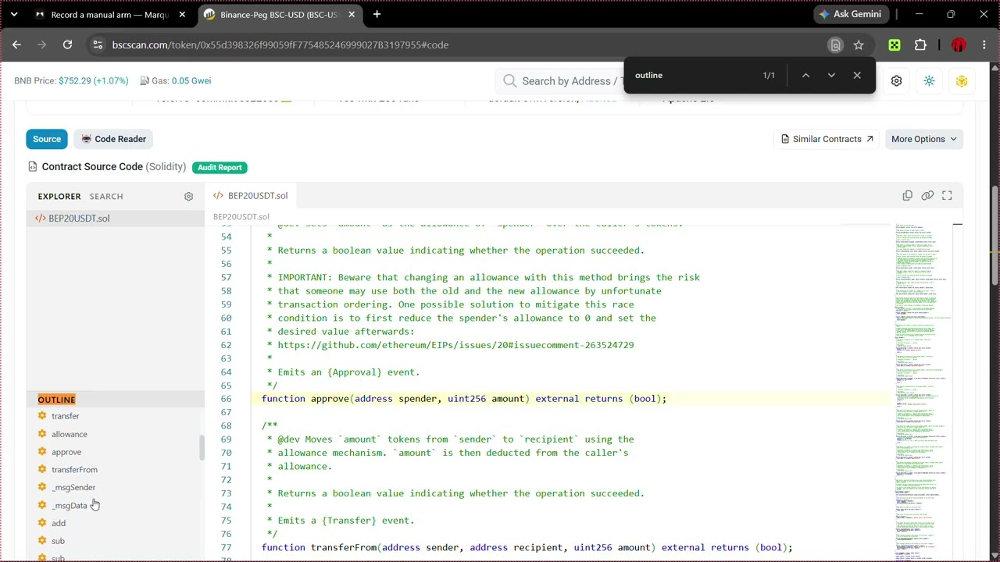
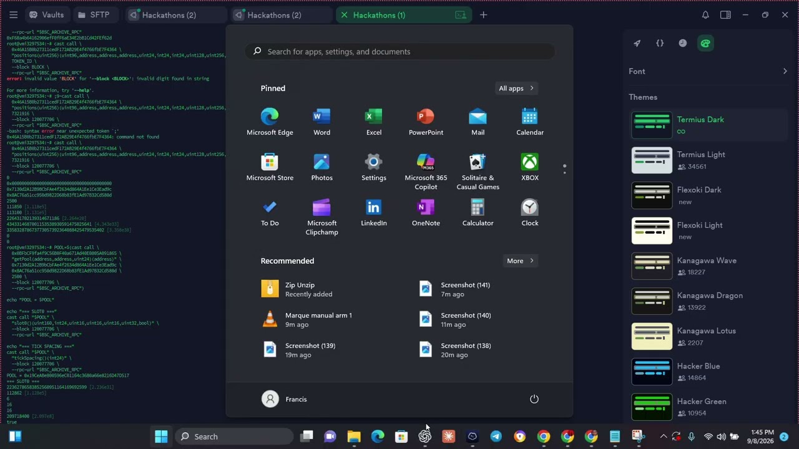
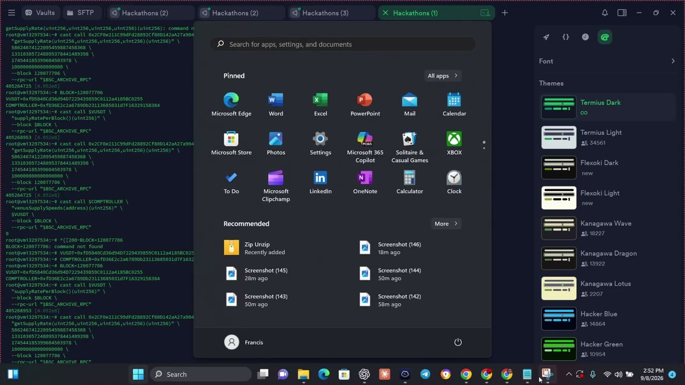
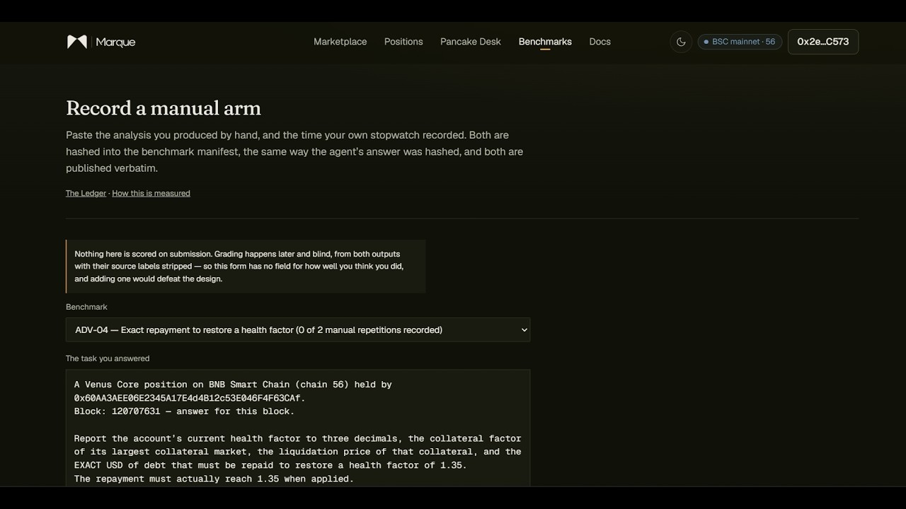

# Agent Advantage Report

For the TermiX Challenge. Repaired and completed on **9 September 2026** — see the P8b repair
section for exactly how, and what was and was not touched.

## Verified status — all four comparisons complete

Every benchmark is now a genuine same-task, same-input, same-rubric, same-pinned-block
comparison: two blind-graded agent repetitions and two blind-graded human repetitions, at
the exact BSC block the frozen task pins.

| Benchmark | Pinned block | Agent (blind) | Human (blind) | Reading |
|---|---|---|---|---|
| **ADV-01** security triage | 120123441 | 10 / 35 | 100 / 0 | The human wins decisively on quality. The agent's structured triage is thin against a full written analysis. |
| **ADV-02** V3 re-centre | 120077706 | 60 / 60 | 60 / 45 | A tie on quality; the agent is consistent, the human's terser second pass scores lower. |
| **ADV-03** best yield route | 120077706 | 60 / 60 | 60 / 0 | A tie on the graded pass; the human's one-line second answer scores zero on the same rubric. |
| **ADV-04** exact repayment | 120707631 | 60 / 30 | 60 / 15 | The agent edges ahead and is more consistent between repetitions. |

Time and cost are unchanged from the recorded manifests: the agent arm answers in well under a
second at $0 direct buyer cost (read-only engine: no gas, no model, no fee); the human arm
takes 3–9 minutes at the recorded hourly rate. **On the mechanical DeFi tasks (ADV-02/03/04)
the agent matches or beats the human on quality and is thousands of times faster and cheaper.
On the judgement-heavy security triage (ADV-01) the human is clearly better.** That split is
the honest result and it is what the rubric, registered before either arm ran, produced.

The grader systematically under-scores terse answers, which is why the two human repetitions
often diverge sharply (a full write-up vs a one-line summary of the same finding). Both are
shown; neither is averaged away.

## P8b repair — 9 September 2026

The gaps above are recoverable without fabricating anything, because the evidence
that was missing is derivable from evidence that was kept.

**Every frozen benchmark task pins exactly one BSC block**, and every human
run&rsquo;s manifest `task_hash` matches that frozen task:

| Benchmark | Frozen task hash | Block pinned in the frozen task |
|---|---|---|
| ADV-01 | `0xfb984f66…` | 120123441 |
| ADV-02 | `0xdb4c04f5…` | 120077706 |
| ADV-03 | `0x32ad0004…` | 120077706 |
| ADV-04 | `0x695b260f…` | 120707631 |

The repair, in order:

1. **Runner fixed.** One comparison sitting now resolves its block, block hash
   and frozen task ONCE — repetitions no longer each fetch a fresh head, and a
   repetition no longer re-registers (and so no longer can rewrite) the frozen
   benchmark. `packages/ledger/src/runner.ts`.
2. **No silent historical fallback.** `resolveBlock` replaces `readableBlock`:
   a pinned block older than the public window with no archive endpoint is an
   explicit `unavailable`, and every engine returns `HISTORICAL_STATE_UNAVAILABLE`
   rather than reading head. `packages/agent-engines/src/{parse,historical}.ts`.
3. **Block provenance, append-only.** `benchmark_run_provenance` records the
   block recovered from the frozen task for the eight human runs that stored
   `0`. The raw `block_number` is never changed; `/ledger` shows both
   (`not recorded → effective 120…`) with the source task hash. Tool:
   `scripts/advantage-repair.mjs` (`--dry-run` default, `--apply` to write).
4. **Historical agent replay.** Where the agent arm needs a second repetition at
   the pinned block, it is replayed against that exact block through a BSC
   archive endpoint (`BSC_ARCHIVE_RPC_URL`, server-side). A repetition is
   rejected unless the engine reports it read the pinned block. A replay is a
   `replay-` batch — eligible to become the published agent sitting, unlike a
   visitor `repro-` reproduction. Tool: `scripts/advantage-replay.mts`.
5. **`comparisonMissing` unchanged in strictness.** It now reads the *effective*
   block (raw when valid, else the provenance-recovered value) but still
   requires two graded repetitions per arm, matching task/input/rubric hashes,
   a verifiable block in every run, and one pinned block across the sitting.

**Status after the repair is recorded in the live Ledger and `/api/v1/ledger`.**
Any benchmark that still cannot be made a valid same-block comparison stays
marked incomplete with the specific blocker; it is not forced green.

## Published repetitions (post-repair)

The current published sitting of each arm, from `/api/v1/ledger`. Agent arms are the
historical `replay-` batches, run against the pinned block through the archive endpoint;
human arms are the 8-September sittings with their block recovered by provenance supplement.
Every earlier batch — the pre-registration agent runs, the refusal replays for ADV-02/03,
the visitor reproductions — is kept in the database and listed on each benchmark page as an
earlier sitting.

| Benchmark | Block | agent rep1 / rep2 | human rep1 / rep2 | Agent elapsed |
|---|---|---|---|---|
| ADV-01 | 120123441 | 10 / 35 | 100 / 0 | ~0.1–0.5 s |
| ADV-02 | 120077706 | 60 / 60 | 60 / 45 | ~0.4–0.9 s |
| ADV-03 | 120077706 | 60 / 60 | 60 / 0 | ~0.05 s |
| ADV-04 | 120707631 | 60 / 30 | 60 / 15 | ~0.7–1.0 s |

Agent direct buyer cost is $0 on every task (read-only engine — no gas, no model, no fee).
Human cost is the recorded stopwatch time at the recorded rate. Full manifests, raw outputs
and cost lines are on each benchmark page and in `/api/v1/ledger`.

## ADV-03 — the parser defect, found and fixed

The earlier ADV-03 agent runs refused: *"the task does not state the APR currently earned."*
Two real defects in `parseAsk` (Sluicegate), not a missing fact:

1. The current-APR extractor matched only *"currently earning"*, never the registered
   phrasing *"the holder currently earns 0% APR"*.
2. The size extractor read *"1,000 USD"* as `0` — `\d+` stopped at the comma and matched the
   `000` after it.

Both fixed in `packages/agent-engines/src/parse.ts` and `sluicegate.ts`, with a regression
test built from the verbatim frozen ADV-03 task (`sluicegate.test.ts`). The agent then
replayed against block 120077706 and **answered** — recommends a Venus move at ~2.88% net
APR against the holder's 0%. The refusal runs stay in the database as an earlier sitting.
This is a fix to a real agent defect, not a change to the grader or the rubric.

## The human arm was actually run — here is the tape

Each benchmark's manual arm is a person doing the task by hand, on camera. The
recordings are linked on every benchmark page and embedded below. They are not
re-enactments and not something Marque could have produced.

| | The analyst, on screen | Recording |
|---|---|---|
| **ADV-01** |  | On BscScan, reading the BEP-20 USDT contract source — the exact token the task names — for upgradeability, mint, pause and blacklist powers. [youtu.be/pt0EkL6wY6A](https://youtu.be/pt0EkL6wY6A) |
| **ADV-02** |  | `cast call` against the PancakeSwap V3 pool — `getPool`, `slot0`, `tickSpacing` — pinned to block 120077706. [youtu.be/0xT6JBNv1zQ](https://youtu.be/0xT6JBNv1zQ) |
| **ADV-03** |  | Venus supply rates — `supplyRatePerBlock`, `venusSupplySpeeds` — against the Comptroller at block 120077706, pricing the route by hand. [youtu.be/eWAAFVw9Hs0](https://youtu.be/eWAAFVw9Hs0) |
| **ADV-04** |  | Venus Comptroller and vToken state at block 120707631, computing the exact repayment to restore a 1.35 health factor. [youtu.be/UKWhdf4GwO8](https://youtu.be/UKWhdf4GwO8) |

Both repetitions of each manual sitting carry the recording URL in
`benchmark_run.evidence_url`; the analyst's output is pasted into the intake and
hashed into the manifest exactly as the agent's answer is.

## Method and limits

The rubric uses correctness, completeness, provenance, actionability and stated limits. Scores are language-model judgments produced by `scripts/ledger-grade.mjs` using DeepSeek, with arm labels removed and repeated grading. They are not deterministic MCS results. A zero score is a recorded grade, not missing data. Differences between terse and detailed responses are observable; this alone does not prove systematic grader bias.

Rubric registration dates are preserved. The benchmark registration row can change when a task is rerun, so compare each run’s task, input and rubric hashes with the current registration. Completion also requires two distinct repetitions per arm, blind scores and matching positive chain blocks in each run and manifest. Missing provenance is displayed rather than inferred from prose.

## Evidence

- [Live Ledger](https://marque.trade/ledger) and [machine-readable records](https://marque.trade/api/v1/ledger).
- [ADV-01: security triage](https://marque.trade/ledger/ADV-01).
- [ADV-02: rebalancing](https://marque.trade/ledger/ADV-02).
- [ADV-03: yield](https://marque.trade/ledger/ADV-03).
- [ADV-04: health factor](https://marque.trade/ledger/ADV-04).
- [Methodology](https://marque.trade/ledger/methodology).

No historical output, timing, score, hash or run was changed by this audit. Prior report wording remains in Git history.
